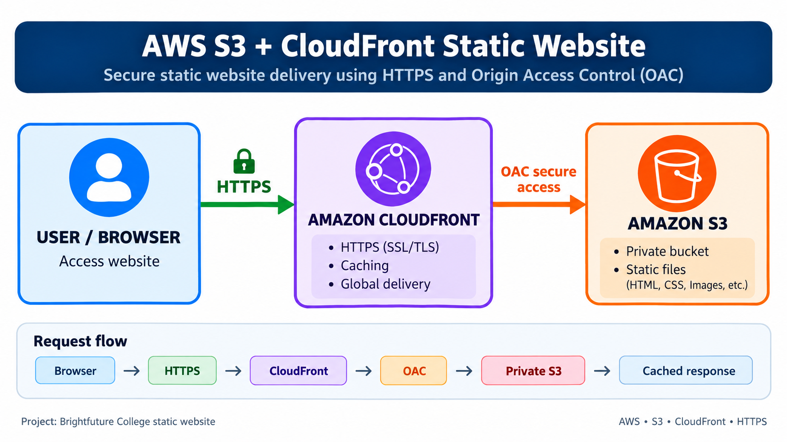
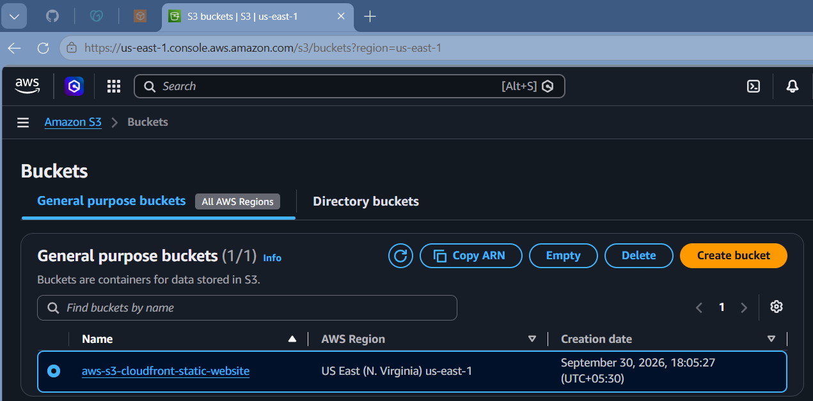
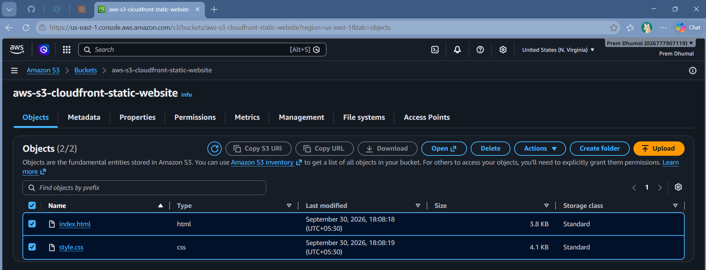
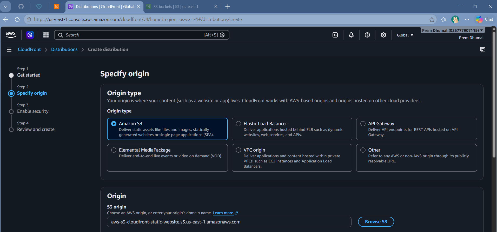
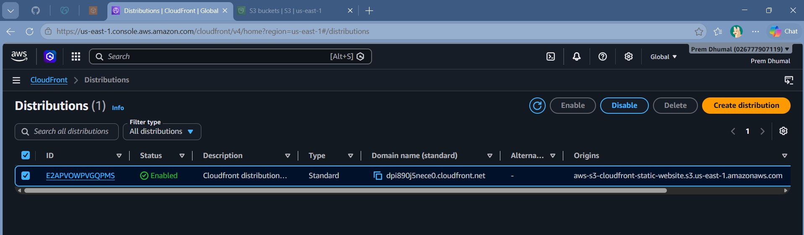
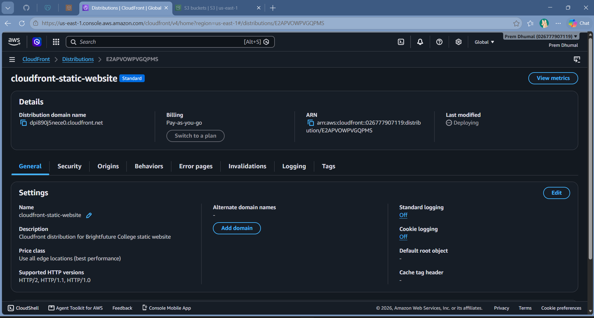
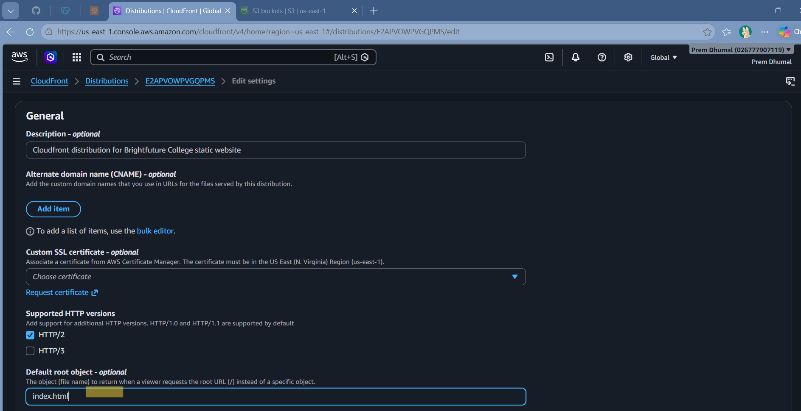
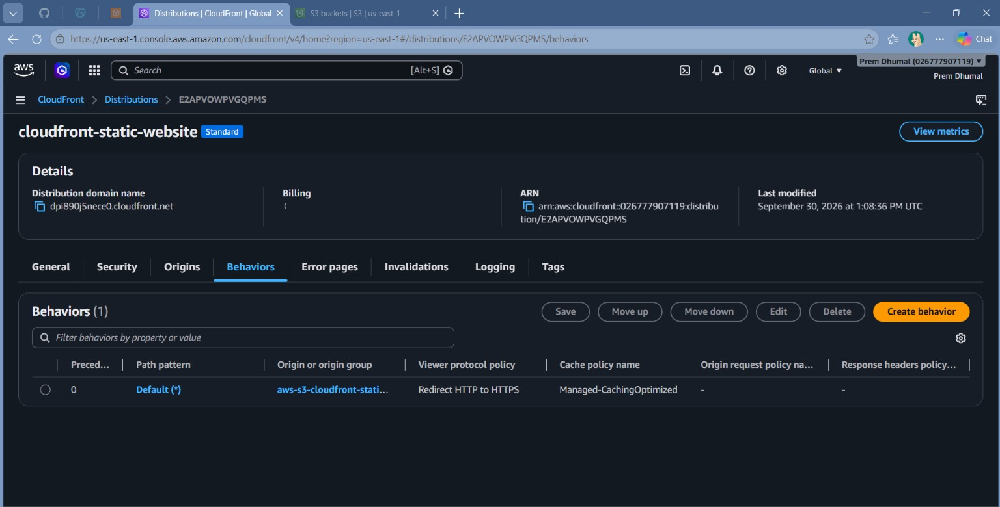
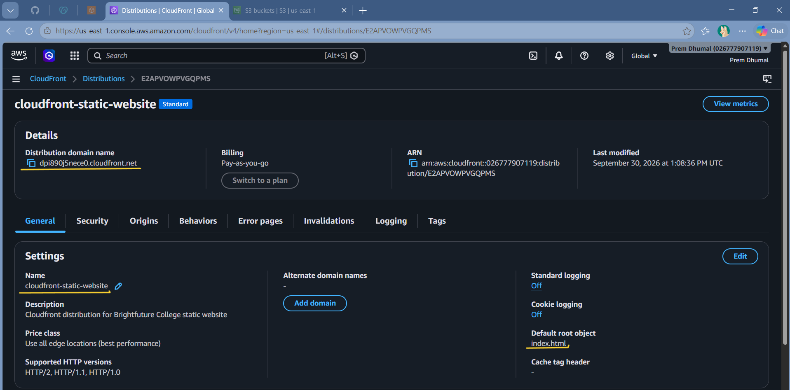
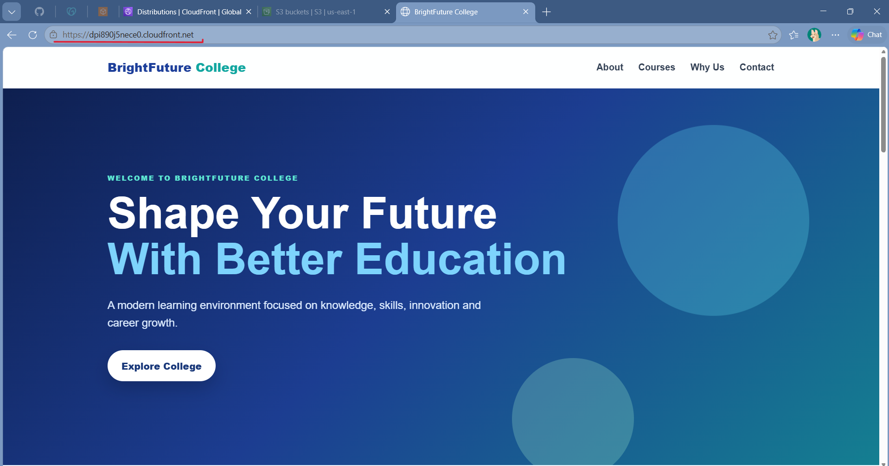

# AWS S3 + CloudFront Static Website Deployment

## Project Overview

This project demonstrates how to host and deliver a static college website using **Amazon S3** and **Amazon CloudFront**.

The website used in this project is **Brightfuture College**. The website contains a simple one-page college introduction, information sections, and contact details.

The S3 bucket stores the static website files, while CloudFront delivers the website over **HTTPS**. CloudFront uses **Origin Access Control (OAC)** to access the S3 bucket securely.

## Architecture



### Request Flow

```text
User / Browser
      |
      | HTTPS
      v
Amazon CloudFront
      |
      | Origin Access Control (OAC)
      v
Amazon S3 (Private Bucket)
      |
      v
Static Website Files
```

## AWS Services Used

- **Amazon S3** – Stores the HTML, CSS and other static website files.
- **Amazon CloudFront** – Delivers the website through AWS edge locations and provides HTTPS access.
- **Origin Access Control (OAC)** – Allows CloudFront to securely access the private S3 origin.
- **HTTPS** – Secures communication between the browser and CloudFront.

## Project Steps

### 1. Create S3 Bucket

An S3 bucket was created to store the static website files.



### 2. Upload Website Files

The website files were uploaded to the S3 bucket. The main entry file is `index.html`.



### 3. Create CloudFront Distribution

Amazon S3 was selected as the CloudFront origin.



### 4. CloudFront Distribution Created

After creating the distribution, the CloudFront distribution appeared in the CloudFront console.



### 5. Configure CloudFront General Settings

The CloudFront general settings were reviewed before deployment.



### 6. Configure Default Root Object

The **Default root object** was configured as:

```text
index.html
```

This allows the website home page to load when the CloudFront root URL is opened.



### 7. Configure HTTP to HTTPS Redirect

The default CloudFront behavior was configured with **Redirect HTTP to HTTPS** so HTTP requests are redirected to HTTPS.



### 8. Deploy CloudFront Distribution

The CloudFront distribution was deployed successfully. The distribution domain name can then be used to access the website.



### 9. Test the Website over HTTPS

The final website was opened using the CloudFront domain over HTTPS.



## HTTPS Configuration

The CloudFront default behavior was configured with **Redirect HTTP to HTTPS**. This makes HTTP requests redirect to HTTPS.

For this project, the CloudFront-provided `cloudfront.net` domain was used, so a custom domain and custom ACM certificate were not required.

## Final Result

The Brightfuture College static website was successfully deployed using: 

**Browser → HTTPS → CloudFront → OAC → Private S3**

The website can be accessed using the CloudFront distribution domain.

## Troubleshooting

### Website does not open

- Check that the CloudFront distribution status is **Deployed**.
- Check that the CloudFront domain name is correct.
- Wait for CloudFront deployment to complete after configuration changes.

### Website shows an Access Denied error

- Check the CloudFront origin configuration.
- Check that Origin Access Control (OAC) is configured correctly.
- Make sure the S3 bucket policy allows the CloudFront distribution to access the required objects.

### Website root URL does not load `index.html`

- Check the CloudFront **Default root object**.
- It should be:

```text
index.html
```

### Old website content is displayed

CloudFront can serve cached content. After changing website files, cache invalidation may be required when the updated content is not appearing.

## What I Learned

Through this project, I learned:

- How to create an S3 bucket.
- How to upload static website files to S3.
- How to use Amazon CloudFront with an S3 origin.
- What an origin is in CloudFront.
- How to configure a CloudFront distribution.
- How to configure the Default root object.
- How to use HTTPS with CloudFront.
- How HTTP requests can be redirected to HTTPS.
- The basic purpose of CloudFront caching.
- How Origin Access Control (OAC) helps secure an S3 origin.
- How to deploy and test a static website on AWS.
- How to document an AWS project with screenshots.

## Conclusion

This project gave me practical experience with **Amazon S3, Amazon CloudFront, HTTPS, caching, and Origin Access Control**. I learned how a static website can be stored in S3 and securely delivered to users through CloudFront.

It also helped me understand the complete flow from **website files in S3 to a live HTTPS website through CloudFront**.

## Screenshot Folder

All project screenshots are available in the [`screenshots`](screenshots/) folder in the same order as the project steps.

---

**Project:** Brightfuture College Static Website

**AWS Services:** Amazon S3 + Amazon CloudFront
